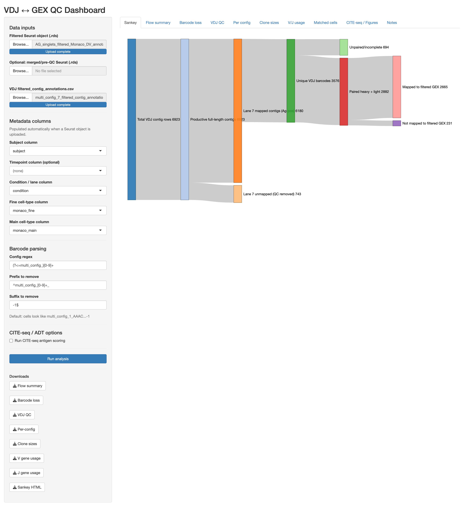

# VDJ ↔ GEX QC Dashboard

> Interactive Shiny dashboard for B-cell receptor (BCR) VDJ ↔ GEX barcode matching, clonotype analysis, barcode recovery assessment, VDJ quality control, and CITE-seq antigen specificity scoring.

[](https://opensource.org/licenses/MIT)
[](https://www.r-project.org/)
[](https://golem.pub/)

<p align="center">
  
  <br>
  <em>Figure 1. Example dashboard showing VDJ ↔ GEX barcode recovery, QC metrics, clonotype statistics, and Sankey visualization.</em>
</p>

---

## Table of Contents

- [Overview](#overview)
- [Features](#features)
- [Installation](#installation)
- [Running the Application](#running-the-application)
- [Input Files](#input-files)
- [Expected Cell Naming Convention](#expected-cell-naming-convention)
- [Barcode Parsing](#barcode-parsing)
- [Workflow](#workflow)
- [Dashboard Tabs](#dashboard-tabs)
- [CITE-seq Antigen Scoring](#cite-seq-antigen-scoring)
- [Example Outputs](#example-outputs)
- [Applications](#applications)
- [Citation](#citation)
- [License](#license)
- [Contact](#contact)

---

## Overview

The **VDJ ↔ GEX QC Dashboard** is a [`{golem}`](https://golem.pub/)-based Shiny application with two integrated pipelines:

**VDJ ↔ GEX QC pipeline** — evaluates barcode recovery between single-cell V(D)J sequencing and gene expression (GEX) datasets, tracking where cells are lost across processing steps.

**CITE-seq antigen scoring pipeline** — scores per-cell ADT signal against a control antigen (HSA), calls antigen-specific B cells at multiple stringency thresholds, and classifies cells by cross-reactivity (mono/bi/multi-reactive). Antigens are detected dynamically from the uploaded Seurat object — no hardcoded names.

The dashboard was originally developed for large-scale immune repertoire studies involving PBMC, vaccine-response, infection, and antigen-specific B-cell datasets.

---

## Features

### VDJ Quality Control

- Total VDJ contigs and productive full-length contigs
- Unique VDJ barcodes
- Paired heavy/light chain (BCR) recovery
- IGH, IGK, and IGL chain counts
- Duplicate heavy chain detection
- Duplicate light chain detection
- Cells with more than two productive chains
- Per-config (per-lane/sample) breakdown of all metrics

### Clonotype Analysis

- Unique, expanded, and singleton clonotype counts
- Largest clonotype size
- Top-25 clone size bar chart (interactive, via plotly)
- Top V gene and J gene usage bar charts (chain-specific)

### VDJ ↔ GEX Integration

- Config-aware barcode matching between VDJ and GEX datasets
- Dual-strategy barcode extraction: regex-based with automatic fallback to raw `[ACGT]{16}` extraction when cell name prefixes are non-standard (e.g. `AG_neg_AAACCTGA...`)
- Three-strategy ag-pos config inference (see [Barcode Parsing](#barcode-parsing))
- Full matched-barcode table with per-cell mapping flags

### Barcode Loss Tracking

When both a merged and a filtered Seurat object are provided, the dashboard tracks cell losses across the full processing pipeline:

```
Paired VDJ Cells
       ↓
Merged / Pre-QC Seurat Object
       ↓
Filtered / Final Seurat Object
```

This allows users to determine whether cells are lost due to QC filtering or were never recovered in GEX at all.

### Sankey Visualizations

**VDJ Sankey** — tracks contigs through the full barcode flow:

```
Total VDJ Contig Rows
         ↓
Productive Full-Length Contigs
         ↓  (optional: Ag-pos lane mapped / unmapped)
Unique VDJ Barcodes
         ↓
Unpaired/Incomplete  ←→  Paired Heavy + Light
                                  ↓
               Mapped to Filtered GEX  ←→  Not Mapped
```

When an antigen-positive sort lane is detected, an additional split showing lane-specific contig mapping is inserted automatically.

**CITE Sankey** — tracks cells through antigen scoring:

```
Ag-pos Contigs
      ↓
Mapped Contigs  ←→  Unmapped (QC removed)
      ↓
Unique VDJ Barcodes
      ↓
Antigen-Specific  ←→  Not Antigen-Specific
      ↓
Mono-reactive / Bi-reactive / Multi-reactive (≥3)
```

### CITE-seq Antigen Scoring

See [CITE-seq Antigen Scoring](#cite-seq-antigen-scoring) for full details.

### Exportable Reports

| Export | Format |
|---|---|
| Flow summary | CSV |
| Barcode loss summary | CSV |
| VDJ QC summary | CSV |
| Per-config summary | CSV |
| Clone size summary | CSV |
| V gene usage | CSV |
| J gene usage | CSV |
| Interactive Sankey | HTML |
| ADT scores (CITE) | CSV |
| Antigen calls (CITE) | CSV |
| Threshold sensitivity (CITE) | CSV |
| Subject summary (CITE) | CSV |
| Cross-reactivity summary (CITE) | CSV |
| Annotated Seurat object (CITE) | RDS |

---

## Installation

### 1. Install Dependencies

```r
install.packages(c(
  "shiny",
  "golem",
  "dplyr",
  "readr",
  "purrr",
  "stringr",
  "tibble",
  "tidyr",
  "rlang",
  "DT",
  "networkD3",
  "htmlwidgets",
  "ggplot2",
  "plotly",
  "heatmaply",
  "Seurat",
  "SeuratObject"
))
```

### 2. Install the Package

Install directly from GitHub:

```r
devtools::install_github("foocheung/vdjgexqc")
```

Or install from a local copy:

```r
devtools::install_local("vdjgexqc")
```

---

## Running the Application

```r
library(vdjgexqc)

run_app()
```

The app automatically sets the upload limit to ~5 GB on launch. If you need to override this:

```r
options(shiny.maxRequestSize = 10000 * 1024^2)  # 10 GB
run_app()
```

---

## Input Files

### Required

**Filtered Seurat object** — your final, QC-passed Seurat object:

```r
saveRDS(pbmc_filt, "pbmc_filt.rds")
```

**VDJ annotation files** — one or more Cell Ranger VDJ filtered contig annotation CSVs. Required columns: `barcode`, `chain`, `productive`, `full_length`. Optional but used when present: `raw_clonotype_id`, `v_gene`, `j_gene`, `cdr3` / `cdr3_aa` / `junction_aa`.

```
multi_config_1_filtered_contig_annotations.csv
multi_config_2_filtered_contig_annotations.csv
...
```

### Optional

**Merged / Pre-QC Seurat object** — enables barcode loss tracking between pre- and post-QC datasets:

```r
saveRDS(pbmc_merged, "pbmc_merged.rds")
```

### For CITE-seq (optional)

The filtered Seurat object must contain an ADT assay (default name `"ADT"`). HSA (Human Serum Albumin) features are auto-detected by name pattern; all remaining ADT features are presented as selectable antigens. No hardcoded antigen names are required.

---

## Expected Cell Naming Convention

By default, Seurat cell names are expected to follow:

```
multi_config_1_AAACCTGAGTAACTTG-1
```

and VDJ filenames are expected to follow:

```
multi_config_1_filtered_contig_annotations.csv
```

Config numbers are extracted from cell names and VDJ filenames using matching regex patterns, enabling config-aware barcode joining. See [Barcode Parsing](#barcode-parsing) for customisation.

---

## Barcode Parsing

Three sidebar fields control how cell barcodes are matched between VDJ and GEX:

| Field | Default | Purpose |
|---|---|---|
| Config regex | `(?<=multi_config_)[0-9]+` | Extracts the config/lane number from cell names |
| Prefix to remove | `^multi_config_[0-9]+_` | Strips the prefix before the raw barcode |
| Suffix to remove | `-1$` | Strips the GEM group suffix |

Barcode extraction uses a two-strategy approach: the regex rules are applied first, and if the result is not a clean `[ACGT]{14-18}` string the app automatically falls back to extracting the raw nucleotide sequence directly. This handles non-standard prefixes such as `AG_neg_AAACCTGA...` without requiring manual regex updates.

### Ag-positive lane detection

The app infers which uploaded VDJ config(s) correspond to the antigen-positive sort lane using three strategies in priority order:

1. **Seurat condition column** — cells whose condition value matches the user-selected "Antigen-POSITIVE sort value" are used to identify the config number(s).
2. **VDJ filename keywords** — filenames containing `ag_pos`, `agpos`, `antigen_pos`, `sorted`, etc. are matched automatically.
3. **Highest numeric config** — falls back to the largest config number among the uploaded files (the original convention).

---

## Workflow

| Step | Action |
|---|---|
| 1 | Upload a filtered Seurat object |
| 2 | *(Optional)* Upload a merged/pre-QC Seurat object |
| 3 | Upload one or more VDJ annotation CSVs |
| 4 | Select metadata columns (subject, timepoint, condition, cell-type) from the sidebar |
| 5 | Review or adjust barcode parsing regex fields |
| 6 | *(Optional)* Enable CITE-seq scoring, select antigens and control, set threshold |
| 7 | Click **Run analysis** |
| 8 | Explore results across dashboard tabs |
| 9 | Export tables and reports |

---

## Dashboard Tabs

### VDJ / GEX tabs

| Tab | Contents |
|---|---|
| **Sankey** | Interactive VDJ → GEX barcode flow diagram |
| **Flow summary** | Contig, barcode, and mapping counts |
| **Barcode loss** | Stage-by-stage barcode loss table (expanded when merged object provided) |
| **VDJ QC** | Full QC metric table including chain counts, duplicate chains, clonotype stats |
| **Per config** | Per-lane/sample breakdown of all QC and mapping metrics |
| **Clone sizes** | Interactive bar chart of top 25 clonotypes + full table |
| **V/J usage** | Interactive top-25 V gene and J gene usage bar charts |
| **Matched cells** | Per-cell barcode matching table with mapping flags |

### CITE-seq / Figures tabs

Only visible when "Run CITE-seq antigen scoring" is enabled.

| Tab | Contents |
|---|---|
| **CITE Sankey** | Cell flow from Ag-pos contigs through antigen specificity and cross-reactivity tiers |
| **Fig 1 — Subject cell counts** | Cells per subject after QC |
| **Fig 3 — ADT dot plot** | Average ADT expression × % expressed per Monaco cell type |
| **Fig 4 — B-cell abundance** | B-cell subpopulation % of all PBMCs per subject |
| **Fig 5 — Cell-type heatmap** | Z-scored cell-type frequencies per subject (hierarchically clustered) |
| **Fig 7 — Antigen vs HSA** | Per-cell antigen signal vs control antigen, faceted by subject and antigen; cells above threshold shown in red |
| **Fig 8 — B-cells by group** | B-cell subtype % within Ag-neg sort vs antigen-positive groups per subject |
| **Fig 9 — IGH clonotypes** | Top IGH CDR3 × V gene lollipop for a selected subject, split by Ag-neg and Ag-pos lanes |
| **CITE QC** | Detected ADT features, threshold sensitivity table, subject summary, cross-reactivity table, ADT score density plots, antigen calls at chosen threshold |

---

## CITE-seq Antigen Scoring

The CITE-seq pipeline scores each cell's ADT signal against a control antigen (HSA) and calls antigen-specific B cells. All antigens are detected dynamically from the Seurat object — no antigen names are hardcoded.

### Antigen detection

On upload, the app scans all ADT feature names. Features matching `HSA`, `Human_Serum_Albumin`, or `albumin` are assigned as control antigens. All other ADT features are offered as selectable target antigens. Both lists can be overridden from the sidebar.

### Specificity thresholds

Antigen-specific calls require a cell to exceed both criteria simultaneously:

| Threshold label | Min (Ag − HSA) | Min Ag/HSA ratio |
|---|---:|---:|
| Loose | 0.5 | 1.5× |
| Medium *(default)* | 1.0 | 2.0× |
| Strict | 1.5 | 3.0× |
| Very strict | 2.0 | 4.0× |

All four thresholds are computed in a single pass and the sensitivity table is always available. The chosen threshold is applied to downstream figures and exports.

### Cross-reactivity classification

Antigen-specific cells are classified by the number of reactive antigens:

- **Mono-reactive** — specific to exactly 1 antigen
- **Bi-reactive** — specific to exactly 2 antigens
- **Multi-reactive (≥3)** — specific to 3 or more antigens

### Comparison groups

Cells are assigned to one of three comparison groups based on the condition column and antigen-specificity call:

| Group | Definition |
|---|---|
| `Ag_pos` | In the Ag-positive sort lane and called antigen-specific |
| `Ag_pos_ag_neg` | In the Ag-positive sort lane but not antigen-specific |
| `Ag_neg_sort` | In the antigen-negative sort lane |

These groups drive Figs 8 and 9 and the CITE Sankey.

### B-cell subtype mapping

If a `monaco_fine` column is present in Seurat metadata, cells are mapped to four canonical B-cell subtypes: Naive, Non-switched Memory, Switched Memory, and Exhausted.

---

## Example Outputs

### Flow Summary

| Metric | Example |
|---|---:|
| Total VDJ contig rows | 25,872 |
| Productive full-length contig rows | 18,341 |
| Unique VDJ barcodes | 12,038 |
| Paired heavy + light VDJ barcodes | 11,409 |
| Total filtered GEX cells | 10,204 |
| Paired VDJ barcodes mapped to filtered GEX | 7,987 |
| Percent paired VDJ mapped to filtered GEX | 70.0% |

### VDJ QC Summary

| Metric | Example |
|---|---:|
| IGH contigs | 12,518 |
| IGK contigs | 7,683 |
| IGL contigs | 5,671 |
| Barcodes with duplicate IGH | 143 |
| Unique clonotypes | 10,694 |
| Expanded clonotypes | 715 |
| Largest clonotype size | 34 |

---

## Applications

This dashboard is suited for:

- Single-cell immune repertoire studies
- B-cell receptor recovery QC
- PBMC datasets with paired VDJ and GEX sequencing
- Antigen-specific B-cell studies using CITE-seq / ADT panels
- Vaccine-response, dengue, HIV, and COVID-19 immune profiling
- Longitudinal immune monitoring with multiple sort lanes

---

## Citation

If you use this dashboard in a publication, please cite the GitHub repository and include the version used:

```
foocheung. vdjgexqc: VDJ ↔ GEX QC Dashboard. GitHub.
https://github.com/foocheung/vdjgexqc
```

---

## License

Distributed under the [MIT License](LICENSE).

---

## Contact

Questions, bug reports, and feature requests are welcome via [GitHub Issues](https://github.com/foocheung/vdjgexqc/issues).